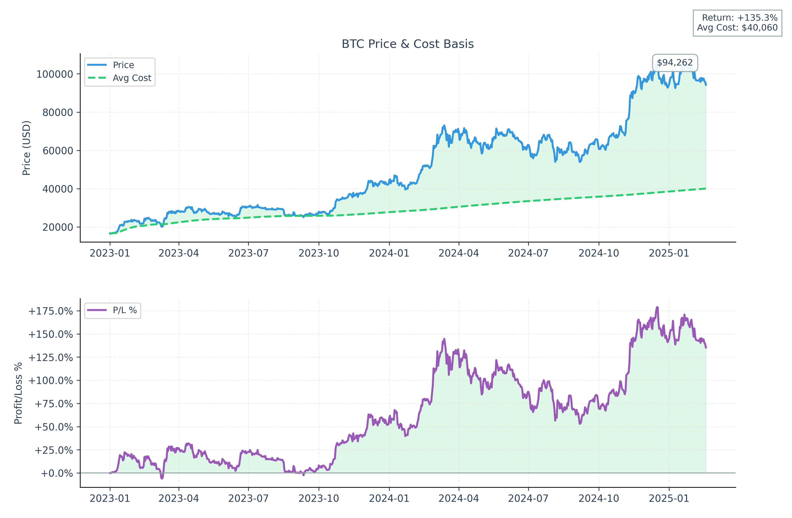

# Crypto DCA Calculator

A Python tool to analyze Dollar Cost Averaging (DCA) investment strategy for cryptocurrencies, supporting multiple pairs and custom buy periods.



## Features

- Historical price data fetching from various exchanges (default: Binance)
- Multi-pair DCA investment simulation with custom allocations
- Flexible buy periods (daily, weekly, biweekly, monthly)
- Detailed investment analysis for each pairdca_btc
- Overall portfolio performance metrics
- Visual representation of results with price charts and P&L graphs
- Support for different trading pairs with percentage allocation
- Configurable daily investment amount
- Fear Index tracking (% of days spent in negative returns)
- Export of analysis results to CSV
- Rich console output with detailed metrics and progress indicators

## Requirements

```
pandas>=2.1.0
matplotlib>=3.8.0
ccxt>=4.1.13
rich>=13.7.0
numpy>=1.24.0
```

## Installation

1. Clone this repository
2. Install dependencies:
```bash
pip install -r requirements.txt
```

## Usage

Basic usage (single pair):
```bash
python dca_btc.py --daily-investment 10 --pairs BTC/USDT:100
```

Multiple pairs with allocation:
```bash
python dca_btc.py --daily-investment 100 --pairs BTC/USDT:80 ETH/USDT:20
```

Weekly investment:
```bash
python dca_btc.py --daily-investment 100 --pairs BTC/USDT:60 ETH/USDT:30 SOL/USDT:10 --buy-period 1w
```

Advanced options:
```bash
python dca_btc.py --start-date 2020-01-01 --end-date 2023-12-31 --daily-investment 100 \
                  --pairs BTC/USDT:50 ETH/USDT:30 DOT/USDT:20 \
                  --exchange binance --buy-period 2w
```

### Arguments

- `--start-date`: Start date in YYYY-MM-DD format
- `--end-date`: End date in YYYY-MM-DD format
- `--last-days`: Calculate for the last N days
- `--daily-investment`: Daily investment amount in USD
- `--exchange`: Exchange to fetch data from (default: binance)
- `--pairs`: List of trading pairs with allocation percentages (e.g., BTC/USDT:80 ETH/USDT:20)
- `--buy-period`: Investment frequency (e.g., 1d=daily, 1w=weekly, 2w=biweekly, 1m=monthly)

## Output

The tool generates:
1. Detailed investment summary for each pair in the console, including:
   - Total investment and current value
   - Average cost basis and current price
   - Profit/Loss metrics with visual indicators
   - Fear Index showing percentage of days in negative territory
   - Highest and lowest prices with dates
2. Overall portfolio performance metrics with allocation breakdown
3. Price charts and CSV files saved with consistent naming (e.g., `dca_analysis_20240219_123456_btc.png` and `dca_analysis_20240219_123456.csv`):
   - Price history and average cost basis
   - Profit/loss percentage over time
   - Key statistics and trends
4. All output files are saved in the `dca/` directory with timestamps for easy tracking

## Examples

1. Invest $100 daily, 80% in BTC and 20% in ETH:
```bash
python dca_btc.py --daily-investment 100 --pairs BTC/USDT:80 ETH/USDT:20
```

2. Weekly $500 investment split across three coins:
```bash
python dca_btc.py --daily-investment 500 --pairs BTC/USDT:50 ETH/USDT:30 SOL/USDT:20 --buy-period 1w
```

3. Monthly $1000 investment in BTC only:
```bash
python dca_btc.py --daily-investment 1000 --pairs BTC/USDT:100 --buy-period 1m
```

## Example Output

When you run the tool, you'll see a detailed analysis in the console like this:

```
╭──────────── 💡 Analysis Parameters ────────────────╮
│ Starting DCA analysis with:                        │
│ • Investment: $100.00 per day                      │
│ • Pairs:                                          │
│   - BTC/USDT: 80.0%                               │
│   - ETH/USDT: 20.0%                               │
╰──────────────────────────────────────────────────╯

For each pair, you'll see detailed metrics including:
• Total invested and current value
• Amount of crypto accumulated
• Net Profit/Loss with percentage
• Fear Index showing negative return days
• Average cost basis and current price
• Historical price extremes with dates

Example portfolio summary:
• Total Investment: $187,600.00
• Current Value: $707,705.49
• Net Profit/Loss: $520,105.49 (+277.24%)

The tool also generates detailed charts and CSV files in the dca/ directory for further analysis.
```

## Notes

- The tool automatically creates a `dca/` directory for storing output files
- Analysis results are saved with timestamps for historical reference
- Uses the Rich library for beautiful console output with progress indicators
- Supports any trading pair available on the selected exchange
- Error handling for network issues and exchange limitations