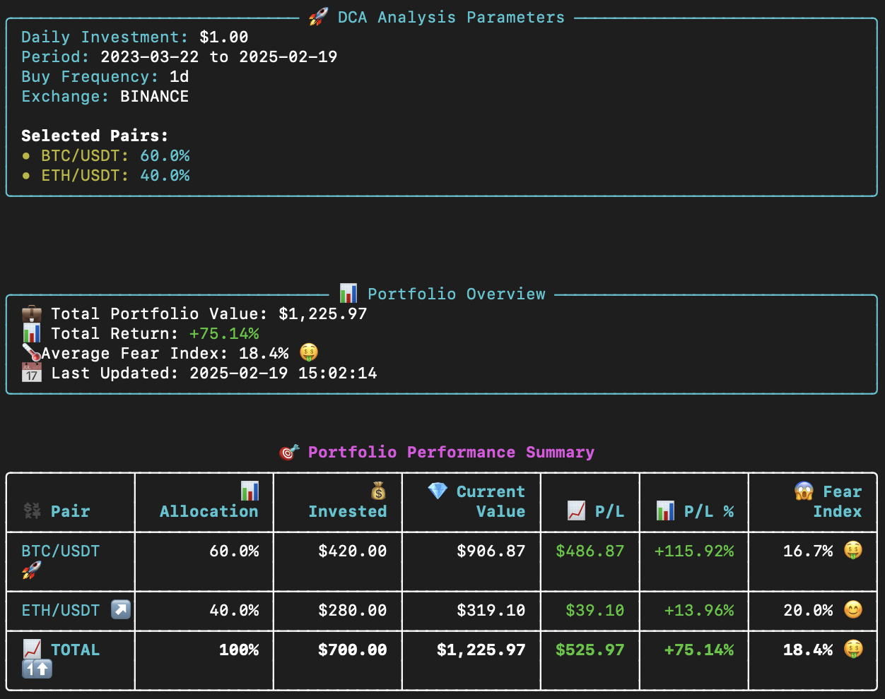
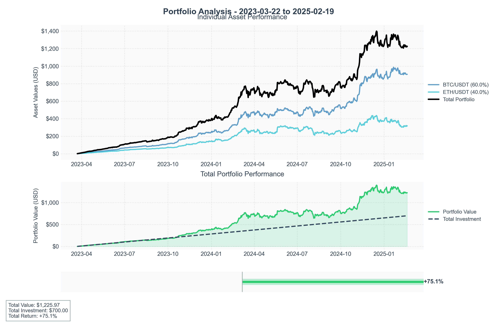

# Crypto DCA Calculator

A Python tool for analyzing **Dollar Cost Averaging (DCA)** investment strategies for cryptocurrencies. Supports **multiple trading pairs**, custom **buy frequencies**, and provides **detailed performance metrics and visualizations**.




## 🚀 Features

✅ **Fetch historical price data** from various exchanges (default: Binance)  
✅ **Multi-asset DCA simulation** with custom allocations  
✅ **Flexible investment schedules** (daily, weekly, biweekly, monthly)  
✅ **In-depth performance analysis** per asset  
✅ **Comprehensive portfolio metrics** with Fear Index tracking  
✅ **Visual insights** via price and P&L charts  
✅ **Intuitive CLI output** with progress indicators

## 🛠 Requirements

Install the following dependencies:

```bash
pip install -r requirements.txt
```

```
pandas>=2.1.0
matplotlib>=3.8.0
ccxt>=4.1.13
rich>=13.7.0
numpy>=1.24.0
```

## 🎯 Usage

### **Basic DCA for a single pair**

```bash
python dca_btc.py --daily-investment 10 --pairs BTC/USDT:100
```

### **Multi-asset DCA with custom allocations**

```bash
python dca_btc.py --daily-investment 100 --pairs BTC/USDT:80 ETH/USDT:20
```

### **Weekly investment**

```bash
python dca_btc.py --daily-investment 100 --pairs BTC/USDT:60 ETH/USDT:30 SOL/USDT:10 --buy-period 1w
```

### **Advanced options**

```bash
python dca_btc.py --start-date 2020-01-01 --end-date 2023-12-31 --daily-investment 100 \
                  --pairs BTC/USDT:50 ETH/USDT:30 DOT/USDT:20 \
                  --exchange binance --buy-period 2w
```

## 📌 Arguments

| Argument | Description |
| -- | |
| `--start-date` | Start date in `YYYY-MM-DD` format |
| `--end-date` | End date in `YYYY-MM-DD` format |
| `--last-days` | Number of recent days to analyze |
| `--daily-investment` | Daily investment amount in USD |
| `--exchange` | Exchange to fetch data from (default: Binance) |
| `--pairs` | Trading pairs with allocation percentages (e.g., `BTC/USDT:80 ETH/USDT:20`) |
| `--buy-period` | Investment frequency (`1d=daily`, `1w=weekly`, `2w=biweekly`, `1m=monthly`) |
| `--plot-type` | Chart output: `'all'`, `'total'`, or `'both'` |

## 📊 Output & Reports

### **1️⃣ Console Summary**

Each run provides a **detailed breakdown** of your investments:

- 📊 **Total Invested & Current Value**
- 🔢 **Accumulated Crypto Amounts**
- 📈 **Net Profit/Loss & PNL%**
- 🛑 **Fear Index (days in negative returns)**
- 💵 **Cost Basis vs. Market Price**
- 📉 **Historic Highs & Lows with Dates**

### **2️⃣ Visual Reports (Saved to `/dca/` directory)**

- **Individual Asset Performance Charts** 📊
- **Total Portfolio Performance Graph** 📈
- **Investment vs. Market Trends** 🔍

## 📍 Example Commands

### **Invest $100 daily, 80% BTC & 20% ETH**

```bash
python dca_btc.py --daily-investment 100 --pairs BTC/USDT:80 ETH/USDT:20
```

### **Weekly $500 DCA across 3 assets**

```bash
python dca_btc.py --daily-investment 500 --pairs BTC/USDT:50 ETH/USDT:30 SOL/USDT:20 --buy-period 1w
```

### **Monthly $1000 BTC investment**

```bash
python dca_btc.py --daily-investment 1000 --pairs BTC/USDT:100 --buy-period 1m
```

### **Generate only the total portfolio chart**

```bash
python dca_btc.py --daily-investment 200 --pairs BTC/USDT:40 ETH/USDT:40 SOL/USDT:20 --plot-type total
```

## 🤝 Contributing

Pull requests and contributions are welcome! Feel free to open issues for improvements.

## 📜 License

This project is open-source under the **MIT License**.
